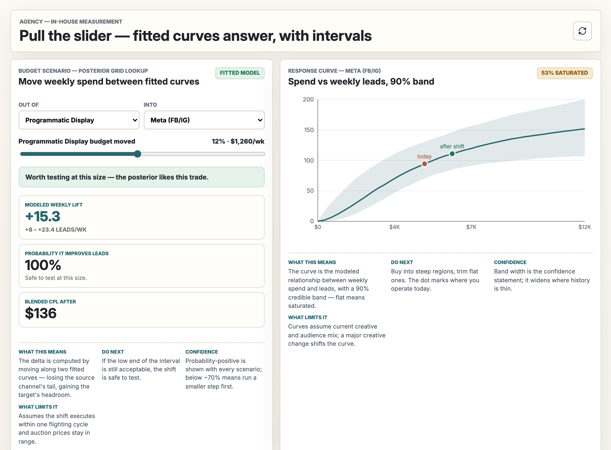

# SignalRig MMM

  

A Bayesian media mix model that shows its work: parameter recovery and holdout
grading are first-class outputs, not an afterthought. This is the open-source
model core of [SignalRig](https://signalrig.co), a macOS app for on-device
media measurement.



*The engine in this repo powering [SignalRig for Mac](https://signalrig.co): pull a spend slider, fitted curves answer with intervals attached.*

## What it is

- **`stan/mmm.stan`**: the model. Normalized geometric adstock (carryover
  window L = 8 weeks), Hill saturation per channel, Fourier seasonality,
  standardized controls, and a CPL-anchored prior center per channel. One
  compiled binary serves both the full fit and the holdout refit.
- **`Sources/FitEngine`**: a pure-Swift orchestration layer (Foundation only,
  no dependencies). Fail-closed CSV panel loading, Stan data preparation,
  4-chain CmdStan process orchestration, draws parsing, posterior grading
  (recovery intervals, holdout MAPE / R-squared / interval coverage, split
  rank-normalized R-hat, bulk ESS), a deterministic budget-allocation
  optimizer, and emitters for a full set of UI-ready artifact JSONs.
- **`Sources/fitengine-cli`**: a command-line driver (`prep`, `fit`, `grade`,
  `artifacts`, `e2e`).
- **`Tests/`**: a self-contained suite including a complete synthetic fixture
  (64 weeks, two geos, four channels) plus malformed variants proving the
  fail-closed input handling.

## The philosophy

Most marketing mix tools ask you to trust a score. This one is built around
the graded exam instead:

1. **Planted-truth recovery.** On synthetic data with known ground truth, the
   model must recover the planted parameters inside its own credible
   intervals, and report exactly how many it recovered.
2. **Blindfold holdout.** The model refits on the first T-12 weeks and is
   scored on the 12 weeks it never saw: MAPE, R-squared, and whether the 90%
   intervals actually cover 90%.
3. **Fail closed.** Malformed input (non-finite numbers, negative spend,
   mixed KPIs, thin history) is a named, specific error, never a silent zero.
4. **Gates before recommendations.** If R-hat, ESS, or divergences miss their
   bars, downstream budget recommendations lock. A fit that did not converge
   does not get to spend your money.

## Quickstart

Requirements: macOS or Linux with a C++ toolchain (to build CmdStan once),
Swift 5.9+, and [CmdStan](https://mc-stan.org/users/interfaces/cmdstan)
(tested against 2.39).

```bash
# 1. Compile the model with CmdStan (one time)
cd <cmdstan-dir> && make <path-to-this-repo>/stan/mmm

# 2. Build the Swift package
swift build -c release

# 3. Run the full pipeline against the bundled synthetic fixture
swift run -c release fitengine-cli e2e \
  --drop Tests/Fixtures/foreign_drop \
  --binary stan/mmm \
  --work /tmp/mmm-work
```

The `e2e` run prints a JSON report: recovery coverage, holdout accuracy, and
sampler diagnostics. On Apple silicon a 104-week, 8-channel panel fits in
about 80 seconds per fit.

## Data contract

Weekly CSVs: `kpi.csv` (date_week, geo, kpi_name, kpi_value) and
`paid_media.csv` (date_week, channel, spend) required; `controls.csv` and
`non_media_treatments.csv` optional. Multiple geos aggregate to national
totals with an explicit warning. Fitting requires at least 52 distinct weeks;
the holdout refit always runs.

## Honest scope

- All accuracy figures in this repo's tests are from synthetic fixtures with
  planted ground truth. They grade the pipeline, not your data.
- Parameter recovery is only possible when truth is known, which means
  synthetic data. On real data the honest evidence is the holdout grade, and
  the artifact emitters say so explicitly.
- The channel registry and prior CPL table are a sample planning library.
  Bring your own priors for your own vertical.

## Provenance

Extracted from the SignalRig macOS app as a clean-room export. The Swift port
was validated line-by-line against a PyMC reference implementation: identical
draws produce identical business metrics to machine precision, and full fits
agree on recovery (24/24 planted parameters) and holdout error (2.6% vs 2.64%
MAPE) within sampling noise.

## The instrument

This engine is the core of **SignalRig for Mac**: the finished instrument built
on it, with the data validator, the interactive views, and the graded exam
presented so a room understands it. Fully offline, $249 once, no subscription.
[signalrig.co](https://signalrig.co)

Buying the app is what funds this open-source work.

## Who makes this

Built by [Joey Arcisz](https://joeyarcisz.com) at
[Geared Like A Machine](https://gearedlikeamachine.com), an independent studio
in Texas that builds production and measurement tooling. If your team wants
help standing up honest media measurement, say hello:
[joey@gearedlikeamachine.com](mailto:joey@gearedlikeamachine.com).

## License

Apache-2.0. See [LICENSE](LICENSE).
